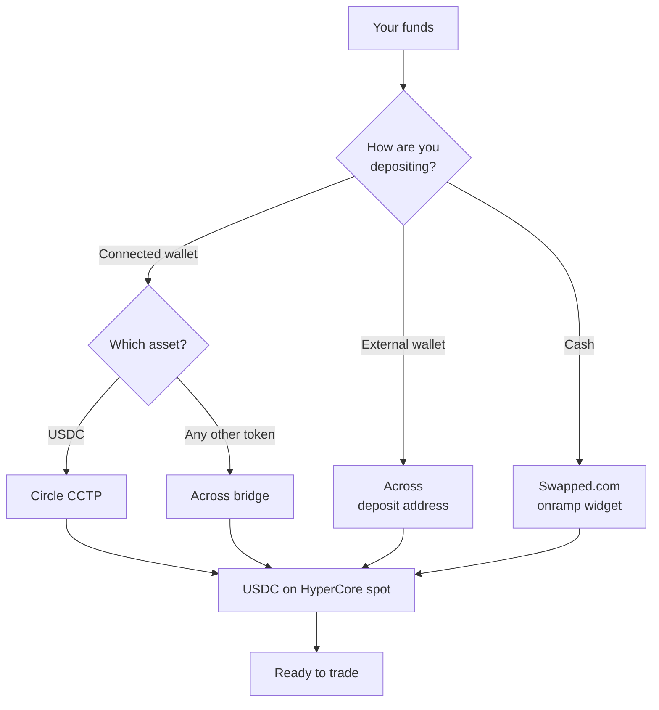

Outcome settles in USDC. Every deposit, whatever you start with and wherever you start from, arrives as USDC in your HyperCore spot balance, ready to trade.

There are three ways to fund your account.

| Method | Best for | Minimum |
| --- | --- | --- |
| **Connected wallet** | You already hold crypto in the wallet you signed in with | $11 |
| **External wallet** | Your funds live somewhere else — an exchange, a hardware wallet, another account | $12 |
| **Cash** | You want to buy with a card or bank transfer | $11 |

<Note>
  Outcome charges no deposit fee. You pay only the network and bridge costs of the route you choose, and these are shown before you confirm.
</Note>

## How deposits are routed

Outcome doesn't move your funds itself. Each deposit is handed to a third-party provider based on what you're sending and where from.

Each provider owns a different part of the journey: Circle's Cross-Chain Transfer Protocol (CCTP) moves native USDC between chains, [Across](https://across.to/) bridges and swaps everything else, and [Swapped.com](https://swapped.com/) handles fiat purchases including payment and identity verification. Outcome is not affiliated with these providers and cannot reverse a transfer once it has left your wallet.

## Deposit from a connected wallet

If you hold funds in the wallet you signed in with, this is the fastest route. You stay in the app and sign a single transaction.

<Steps>
  <Step title="Open the Deposit panel">
    Go to [outcome.xyz](https://outcome.xyz) and open **Deposit**, then choose the **Crypto** tab.
  </Step>

  <Step title="Pick your asset and amount">
    Select the token you want to send and enter an amount. The minimum is $11.
  </Step>

  <Step title="Review the breakdown">
    Fees, network cost, and estimated time appear before you confirm. Check them.
  </Step>

  <Step title="Confirm in your wallet">
    Approve the transaction. Your balance updates when the deposit lands.
  </Step>
</Steps>

### Depositing USDC

USDC deposits take a dedicated fast path through Circle's CCTP from these networks:

| Network | Typical time |
| --- | --- |
| Arbitrum | ~15 seconds |
| OP Mainnet | ~18 seconds |
| Base | ~18 seconds |
| Unichain | ~18 seconds |
| World Chain | ~18 seconds |
| Ethereum | ~20 seconds |
| Linea | ~22 seconds |
| HyperEVM | ~3 seconds |

CCTP charges a flat fee — Circle's protocol fee plus a forwarder fee — with no swap and no slippage. Times are typical, not guarantees; network congestion can push them higher.

### Depositing other assets

Any other token routes through Across, which bridges and swaps it to USDC on the way in. Outcome bundles the swap, the bridge, and any destination-chain swap into a single sponsored transaction, so you still sign only once.

Because these routes involve a swap, the breakdown shows a maximum slippage and a minimum you'll receive. The slippage figure comes from the bridge provider and isn't something you can set.

## Deposit from an external wallet

If your funds are on an exchange, a hardware wallet, or any account that isn't the wallet you signed in with, Outcome gives you a deposit address to send to.

<Card title="Deposit from an external wallet" icon="wallet" href="/deposits/external-wallet">
  One permanent address, how to use it, and what to check before you send.
</Card>

## Deposit with cash

The **Cash** tab opens a [Swapped.com](https://swapped.com/) widget that lets you buy USDC with a card or bank transfer. Swapped owns the entire purchase — supported currencies, payment methods, and identity verification (KYC) are theirs, and availability depends on your region.

The minimum is $11. Once the purchase clears, USDC arrives in your account the same way any other deposit does.

## Activation fee

The first time a brand-new HyperCore account makes an outbound action, Hyperliquid charges a one-time 1 USDC activation fee. Outcome surfaces it in the deposit breakdown so you see the full cost up front, but the protocol deducts it on your first withdrawal or transfer, not on the deposit itself.

## Where your funds land

Deposits arrive as USDC in your HyperCore spot balance and are ready to trade immediately. There is no separate "Outcome account" and nothing to convert — your balance is tied to the wallet you connected.

<CardGroup cols={2}>
  <Card title="Deposit from an external wallet" icon="wallet" href="/deposits/external-wallet">
    Send from an exchange or another wallet using your deposit address.
  </Card>

  <Card title="Track a deposit" icon="clock" href="/deposits/status">
    Timing, how to confirm arrival, and what to do if funds don't show up.
  </Card>
</CardGroup>
