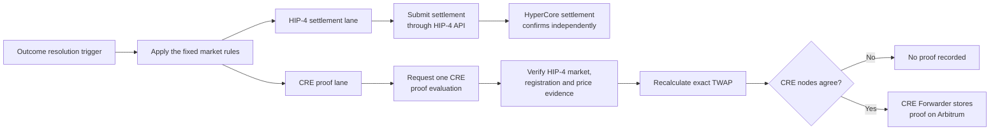
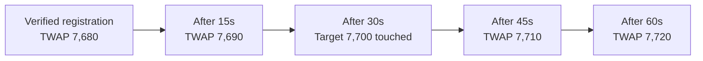

This page explains how Outcome price markets are settled through HIP-4 and how Chainlink CRE records an independent proof of the result on Arbitrum. Each market follows rules fixed before trading starts: the underlying, price source, TWAP window, expiry or deadline, and strike. The technical market specification records these rules using `schemaVersion: 2`.

CRE is not the source of truth for HIP-4 settlement. Once Outcome's resolution process determines a result, two independent processes run in parallel:

1. Outcome submits the settlement through the HIP-4 API on HyperCore.
2. Chainlink CRE independently verifies the same market definition and price evidence, repeats the deterministic calculation, and records an authenticated proof on Arbitrum.

Outcome uses Arbitrum for the proof record because it provides a fast, low-cost receipt layer. The HIP-4 settlement and Arbitrum proof are separate, non-atomic transactions. Neither transaction authorizes, executes, or waits for the other, and either may confirm first.

## What determines the result

Each market defines:

- A price underlying, such as the native `BTC` perpetual on HyperCore or a HIP-3 perpetual such as `xyz:SP500`.
- The authoritative input field. Venue `out` price templates use HyperCore-accepted `markPx`; no separate last or final price is supplied as a market parameter.
- A TWAP duration.
- An expiry for `binaryPrice`, or a deadline for `priceTouch`.
- A strike, stored as `threshold` for `binaryPrice` or `target` for `priceTouch`.

Both resolution processes apply these fixed rules. In the CRE proof lane, CRE verifies the live HIP-4 market, its template, and its committed Hyperliquid registration block before retrieving price history and repeating the calculation. The specification stored in the Arbitrum proof contract must exactly match the verified HIP-4 definition.

> **Note:** All market times are UTC. Specifications use RFC 3339 whole-second timestamps, contract lifecycle fields use Unix seconds, and price observations and CRE proof fields use Unix milliseconds.



`ResolutionRequested` is only an authenticated trigger and nonce for one CRE proof evaluation. It is not a HIP-4 settlement and does not itself contain a final result.

Outcome tracks the **calculated result**, **HIP-4 settlement**, and **CRE proof recorded onchain** as separate states.

## The price source

Hydromancer is the API used by CRE to retrieve HIP-4 registration records and historical HyperCore-accepted perpetual-price rounds. Hydromancer does not decide Yes or No, settle the HIP-4 outcome, or sign the onchain proof. CRE verifies the evidence, performs the exact calculation, and signs a report only when its nodes agree.

All CRE nodes query the same Hydromancer upstream. CRE therefore provides execution consensus over the same price provider, not a quorum of independent price sources.

CRE requests accepted historical rounds using `perpPriceHistoryByTime`. This illustrative `xyz:SP500` row shows the fields used by the resolver:

```json
{
  "time": 1788367197700,
  "blockNumber": 1130393772,
  "dex": "xyz",
  "coin": "xyz:SP500",
  "markPx": "7705.25"
}
```

Market identity and DEX routing are validated together:

- Native `BTC` is requested with `coin: "BTC"` and DEX `main_dex`; accepted rows identify DEX `hyperliquid`.
- `xyz:SP500` is requested with `coin: "xyz:SP500"` and DEX `xyz`; accepted rows also identify DEX `xyz`.
- Venue `out` identifies the HIP-4 venue. It is never used as the price DEX.

Before requesting price history, CRE checks that the HIP-4 outcome ID identifies one active standalone market at venue `out`, that its Yes/No sides and live template have the reviewed structure and meaning, and that every canonical parameter matches the specification stored in the Arbitrum proof contract.

Hydromancer supplies the registration record. CRE then independently anchors it against the matching HyperCore Explorer action, transaction, block, timestamp, and deployer.

Within the CRE proof lane, before calculating and signing a result, CRE also checks that:

- Every round matches the exact market coin and DEX.
- Every accepted round has a positive block number.
- The exact `markPx` field is present. CRE never substitutes `oraclePx`, spot price, index price, an exchange close, or the last available observation.
- Each price is a plain decimal that can be represented exactly.
- Identical duplicate timestamps are removed, while conflicting prices at the same timestamp invalidate the evidence.
- The history covers both boundaries of the TWAP window.
- No gap affecting the calculation is greater than 15 seconds.
- The full history was retrieved. A response at Hydromancer's 2,000-row limit is split into smaller overlapping requests.

If any check fails, CRE does not guess and does not turn missing data into No. CRE emits no proof report, and the Arbitrum proof record remains unset. This does not determine or block the independent HIP-4 settlement process.

> **Price-source definition:** The settlement proof uses the HyperCore-accepted `markPx` for `xyz:SP500` returned by Hydromancer. The resolver does not substitute a separately fetched traditional-exchange closing print.

## How TWAP is calculated

TWAP means **time-weighted average price**. A price contributes according to how long it was active, not according to how many rows appear in the response.

When Hydromancer reports a price at time `t`, that price remains active until the next accepted round. For a window starting at `a` and ending at `b`:

```text
TWAP[a,b) = sum(price × time active inside the window) / (b - a)
```

`[a,b)` means the start is included and the end is excluded. A round exactly at `b` proves boundary coverage but contributes zero time to that completed window.

The binary example below uses:

```text
Asset: native BTC perpetual on HyperCore
a:     2026-09-30T23:59:59Z
b:     2026-10-01T00:00:00Z
Window: [a,b), exactly 1 second or 1,000 milliseconds
```

Prices are converted into exact fractions and calculated with integers. This avoids floating-point rounding and makes the result reproducible across CRE nodes and independent implementations.

## Price Binary

`binaryPrice` asks whether one completed TWAP is **strictly greater than** the strike (`threshold` in the market specification). For a TWAP duration `W`, the calculation window is:

```text
[expiry - W, expiry)
```

Consider this illustrative market:

```text
Question: Will the 1-second TWAP of the native HyperCore BTC perpetual markPx
          be strictly greater than 100,000 USDC at 2026-10-01T00:00:00Z?
TWAP duration: 1 second
Price field: markPx
Strike (`threshold`): 100,000
```

The accepted mark prices are:

| Time inside `[a,b)` | Mark price | Meaning |
|---:|---:|---|
| 0 ms | 99,900 | Price starts at `a` |
| 250 ms | 100,100 | Price changes 250 ms into the window |
| 1,000 ms | 99,800 | Row at `b`; proves coverage but has zero weight |

The weighted calculation is:

| Segment | Price | Time active | Contribution |
|---|---:|---:|---:|
| `[0ms,250ms)` | 99,900 | 250 ms | 24,975,000 |
| `[250ms,1,000ms)` | 100,100 | 750 ms | 75,075,000 |
| At `1,000ms` | 99,800 | 0 ms | 0 |

```text
TWAP = (99,900 × 250 + 100,100 × 750) / 1,000
     = 100,050,000 / 1,000
     = 100,050
```

The deterministic calculation yields Yes because:

```text
100,050 > 100,000
```

CRE can therefore record a Yes proof on Arbitrum while the independent HIP-4 process submits and confirms the settlement on HyperCore.

The comparison is strict:

| Calculated TWAP | Comparison with 100,000 | Result |
|---:|---|---|
| 100,050 | `100,050 > 100,000` | Yes |
| 100,000 | `100,000 = 100,000` | No |
| 99,950 | `99,950 < 100,000` | No |

Equality therefore means No. The simple row average would be wrong because the prices were active for different lengths of time and the final row has zero weight.

For `binaryPrice`, the proof reports the exact TWAP, not the final raw `markPx` observation:

```text
priceNumerator   = 100050
priceDenominator = 1
```

The live HIP-4 template also specifies a delisting fallback using the HyperCore settlement price at delisting. The current CRE proof workflow fails closed until that delisting evidence can be independently verified; it never substitutes ordinary TWAP history or another price for the delisting value.

## Price Touch

`priceTouch` asks whether a rolling TWAP equals or crosses the strike (`target` in the market specification) at any point during the market's eligible life. For a rolling window `W`, CRE evaluates:

```text
(verified Hyperliquid registration time, deadline]
```

The start is the timestamp of the exact HIP-4 registration transaction, cross-checked against its committed Hyperliquid block. The Arbitrum proof contract's `createdAt` value is audit metadata and is not used in this calculation.

Consider this illustrative market:

```text
Question: Will the rolling 60-second HyperCore markPx TWAP for xyz:SP500
          touch or cross 7,700 by 2026-10-01T00:00:00Z?
Rolling window: 60 seconds
Price field: markPx
Strike (`target`): 7,700
```

Assume the mark price was `7,680` for the 60 seconds before the verified registration time. At registration it changes to `7,720` and remains there.

After `x` seconds, the rolling window contains `60 - x` seconds at `7,680` and `x` seconds at `7,720`:

```text
Rolling TWAP(x) = [7,680 × (60 - x) + 7,720 × x] / 60
                = 7,680 + (2/3)x
```

| Time after verified registration | Rolling-window calculation | Rolling TWAP |
|---:|---|---:|
| 0 seconds | `(7,680 × 60) / 60` | 7,680 |
| 15 seconds | `(7,680 × 45 + 7,720 × 15) / 60` | 7,690 |
| 30 seconds | `(7,680 × 30 + 7,720 × 30) / 60` | 7,700 |
| 45 seconds | `(7,680 × 15 + 7,720 × 45) / 60` | 7,710 |
| 60 seconds | `(7,720 × 60) / 60` | 7,720 |



At 30 seconds, the rolling TWAP equals `7,700`. The deterministic CRE calculation therefore yields Yes and can record a Yes proof. The independent HIP-4 settlement process applies its own submission and confirmation lifecycle.

Hydromancer does not need to publish a raw `markPx` of exactly `7,700`. The rolling TWAP changes continuously between calculation breakpoints. CRE checks every point where its direction or slope can change and solves the exact crossing time when adjacent values lie on opposite sides of the target. A crossing can occur between millisecond observations, so its time is preserved as an exact fraction.

The boundary rules are:

- A touch exactly at the verified registration time does not count.
- A touch after the verified registration time counts.
- A touch exactly at the deadline counts.
- Before the deadline, no proven touch means no final CRE proof yet; it does not mean No.
- After the complete interval has been checked, no touch produces a No calculation.

Each `ResolutionRequested` event starts one CRE proof evaluation. CRE does not continuously poll for a later touch and does not control or block HIP-4 settlement. If a touch is not yet proven, CRE sends no final proof report. After the 30-minute pending-request timeout, another CRE proof request can be made. This timeout protects the proof nonce from delayed or replayed reports; it is not settlement calculation time and does not delay the independent HIP-4 process.

For the successful touch above, the CRE proof stores:

```text
outcome          = Yes
priceNumerator   = 7700
priceDenominator = 1
touch time       = verified registration time + 30 seconds
```

> **Note:** For `priceTouch`, the proof price is the target. For Yes, this is also the rolling TWAP at the exact touch. For No, it remains the comparison target and is not the final rolling TWAP at the deadline. No separate final raw `markPx` is stored.

The live `priceTouch` template also contains a delisting rule. The current CRE proof lane fails closed until the HyperCore settlement price at delisting can be independently verified.

## What the CRE proof records onchain

CRE nodes independently retrieve and process the required evidence. A report is signed only when the required proof fields are identical. The Chainlink Forwarder then submits that report to the proof contract on Arbitrum.

The contract authenticates and stores the CRE proof. It does not settle the HIP-4 outcome, download the price history, repeat the TWAP calculation, compare the strike, or independently validate the reported calculation and window times. It verifies that:

- The configured Chainlink Forwarder submitted the report.
- The workflow owner and workflow ID are authorized.
- The proof record has a pending request.
- The request nonce matches, so an old report cannot resolve a newer proof request.
- `specHash` matches the exact HIP-4 resolution rules stored in the proof contract.
- The report is well formed and includes an evidence commitment.

The contract stores a compact proof record rather than the full price tape. The canonical HIP-4 outcome ID is supplied when the corresponding proof record is registered on Arbitrum; the contract does not allocate a separate local ID. The same ID is used as the storage key, carried through the signed CRE report, and written explicitly into the proof record.

For an illustrative HIP-4 outcome `1209`, `getResolutionRecord(1209)` returns fields including:

```text
hip4MarketId:        1209
calculationType:     BINARY_PRICE
outcome:             Yes
priceNumerator:      100050
priceDenominator:    1
windowStartMs:       <2026-09-30T23:59:59Z>
windowEndMs:         <2026-10-01T00:00:00Z>
observationCount:    3
largestGapMs:        750
specHash:            <hash of the market rules>
evidenceHash:        <hash of HIP-4 registration and price evidence>
```

The getter key and stored `hip4MarketId` are the same canonical HIP-4 outcome ID. No later identifier mapping is required.

`specHash` binds the proof to the exact `resolutionData` stored for the HIP-4 outcome. `evidenceHash` commits to the verified live market and template definitions, canonical parameters, registration deployer, transaction, block and timestamp, requested price range, and normalized observations. Anyone can reproduce the commitment when those inputs are made available, without placing the full price history onchain.

An Arbitrum Yes or No proof records CRE's independent calculation. It does not by itself prove that the separate HIP-4 settlement transaction has confirmed, so Outcome tracks both statuses independently.

## Deployment details

The deployment values for each network will be published here:

| Item | Arbitrum Sepolia | Arbitrum One |
|---|---|---|
| Resolution proof contract | `EMPTY` | `EMPTY` |
| Chainlink Forwarder | `EMPTY` | `EMPTY` |
| CRE workflow ID | `EMPTY` | `EMPTY` |
| CRE workflow owner | `EMPTY` | `EMPTY` |
| Contract admin | `EMPTY` | `EMPTY` |

## CRE proof states

| State | What it means |
|---|---|
| Proof pending | A CRE proof request is active. This does not describe or block HIP-4 settlement. |
| Proof recorded: Yes | CRE independently calculated Yes and the authenticated proof was stored on Arbitrum. |
| Proof recorded: No | CRE checked the complete eligible interval, independently calculated No, and stored the proof on Arbitrum. |
| Proof unavailable / retry | CRE could not verify complete evidence or reach agreement, so no final proof was stored. Another proof request may be made after recovery. |
| Proof record cancelled | The owner used the time-gated recovery path for an EVM proof record that could not be completed. This does not cancel or change the HIP-4 outcome. |

Only a final Yes or No report is stored through the normal CRE proof path. Missing data, incomplete history, provider errors, or CRE disagreement never become an automatic market result and never control the independent HIP-4 settlement process.
